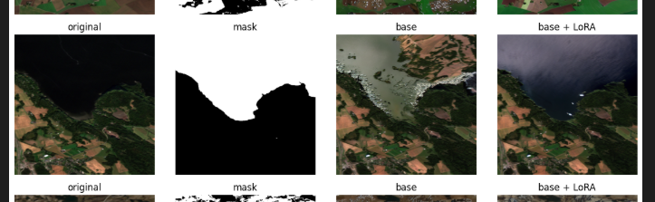
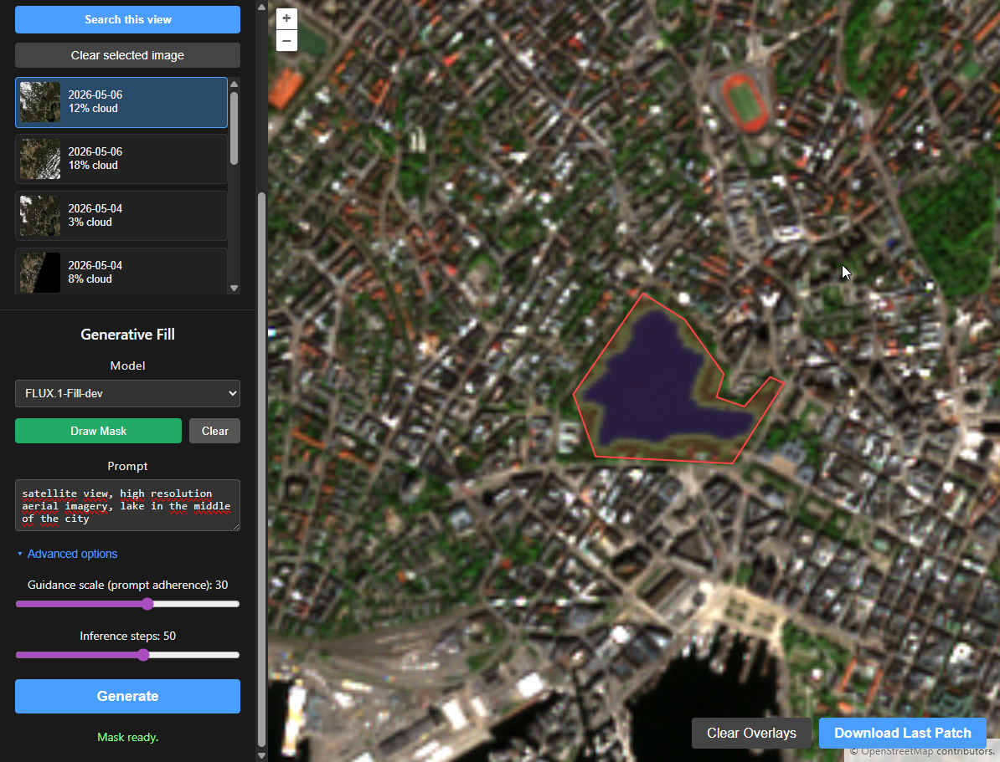
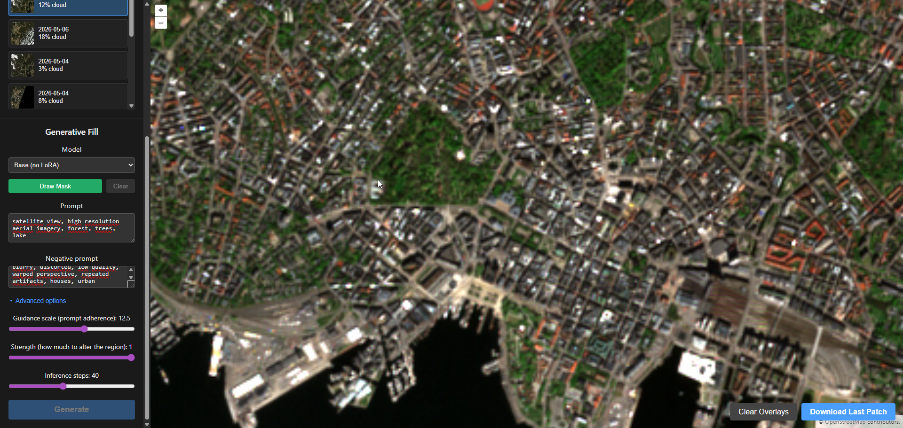
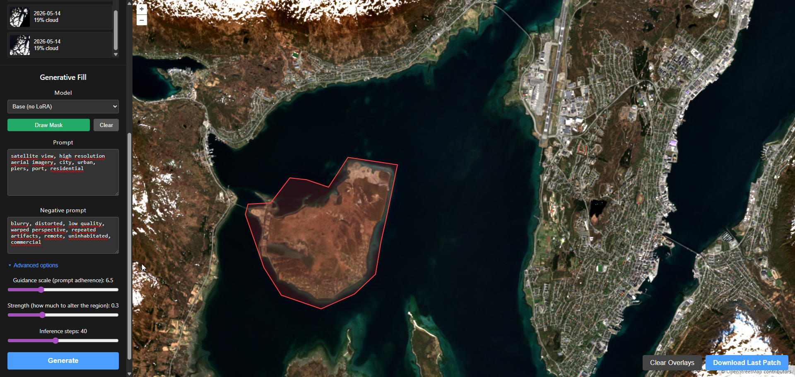
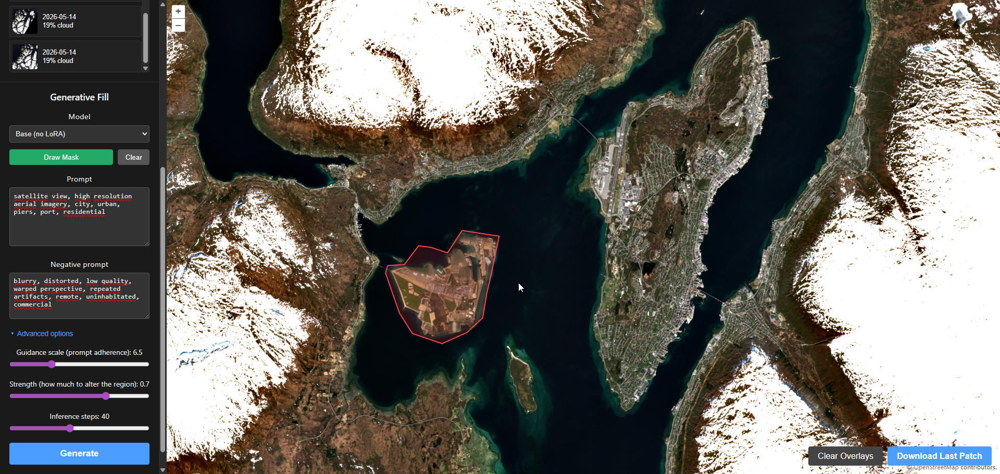
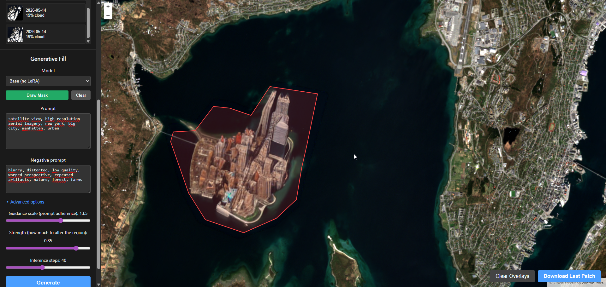
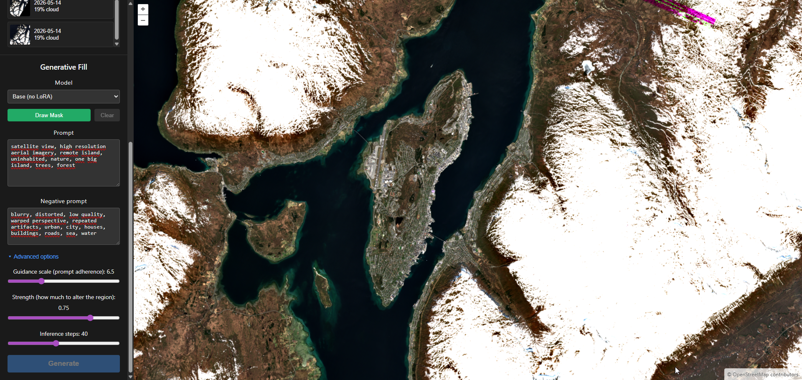
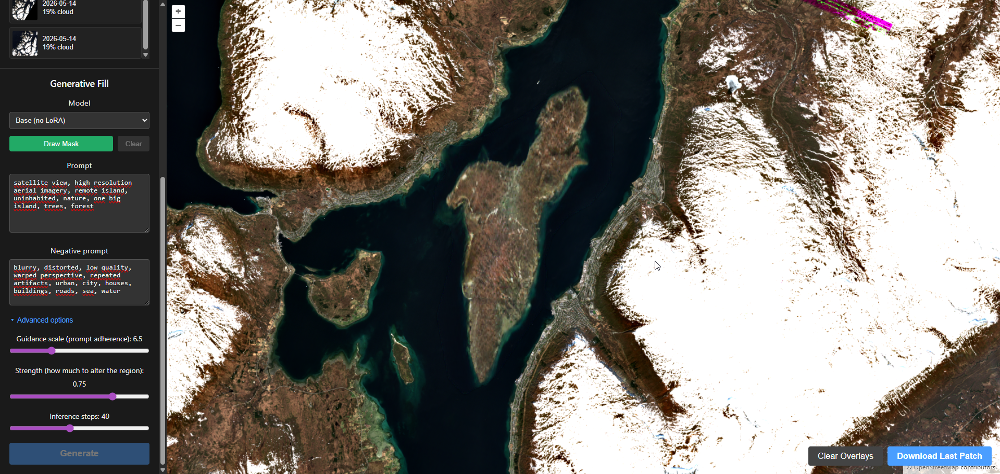
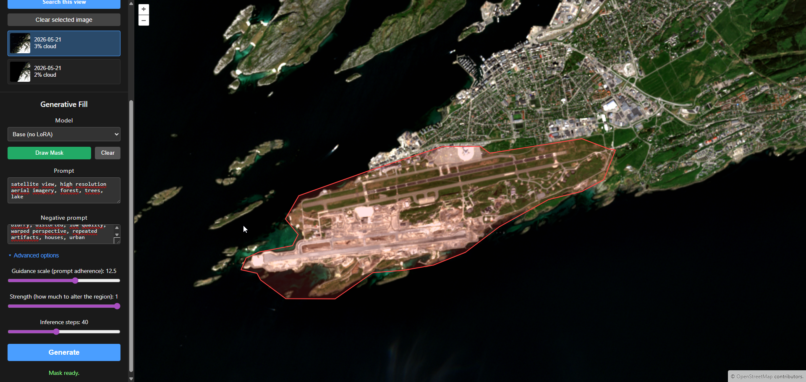
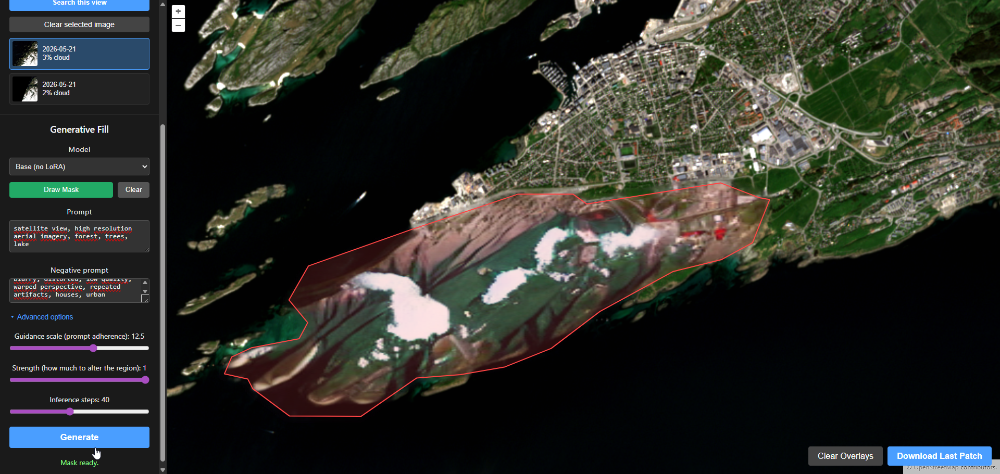

# INF-3600 — Satellite Generative Fill

A web app for **inpainting open satellite imagery**. Users search free/open STAC
catalogues (Sentinel-2 via Earth Search), stream the selected Cloud Optimized GeoTIFF
(COG) onto a map, draw a polygon over an area, type what should appear there, pick a
model, and get back an inpainted patch overlaid in place.

[Link to demo video](https://youtu.be/oKv8LfeDaoA)

```
┌─────────────┐   /catalog/search   ┌──────────────┐  pystac-client   ┌──────────────┐
│  frontend   │ ──────────────────▶ │   backend    │ ───────────────▶ │ Earth Search │
│ React + OL  │ ◀── scenes (COG) ── │   FastAPI    │                  │  (STAC API)  │
│             │                     │              │                  └──────────────┘
│  draw mask  │     /inpaint        │ rasterio COG │   SD1.5-inpaint + LoRA (diffusers)
│  + prompt   │ ──────────────────▶ │ + pipeline   │ ──▶ PNG patch ──▶ map overlay
└─────────────┘                     └──────────────┘
        │ streams the selected scene's COG directly (browser → S3) via OpenLayers
        └──────────────────────────────────────────────────────────────────────▶
```



Three parts of the repo:

| Dir                          | What it is                                                                                             |
| ---------------------------- | ------------------------------------------------------------------------------------------------------ |
| [`frontend/` ](./frontend/)  | React 19 + Vite + OpenLayers map UI ([details](frontend/README.md)).                                   |
| [`backend/` ](./backend/)    | FastAPI service: catalogue search + COG reading + inpainting inference ([details](backend/README.md)). |
| [`notebooks/`](./notebooks/) | LoRA training + dataset prep ([details](notebooks/README.md)).                                         |
| [`datasets/`](./datasets//)  | Folder for manual and automatic datasets ([details](datasets/README.md)).                              |

## Prerequisites

- [`uv`](https://docs.astral.sh/uv/) (Python tooling) and **Python 3.12**.
- Node.js LTS + npm. (Recommend to manage node version through [NVM](https://github.com/nvm-sh/nvm) )
- A **CUDA GPU** for usable inference latency, preferably with either 10gb+ or 22gb+ vram (22 needed for flux.1 model)
- Trained LoRA weights exported into `backend/models/` (see step 1).

## Quick start (Docker Compose)

The fastest way to get both services up. Requires **Docker** + **Docker Compose**, and the
[NVIDIA Container Toolkit](https://docs.nvidia.com/datacenter/cloud-native/container-toolkit/latest/install-guide.html)
on the host for GPU inference.

```bash
# Optional: token for the gated flux-fill model; skip if you only use base/LoRA.
export HF_TOKEN=hf_...

docker compose up --build
#   frontend -> http://localhost:5173
#   backend  -> http://localhost:8000  (docs at /docs)
```

- **First build is slow (~5–7 min)** — the backend image bundles PyTorch + CUDA + diffusers
  (several GB). Later builds reuse the cached dependency layer and are much faster.
- On **first run** the backend downloads the ~2GB base model into the `hf-cache` volume, so it
  persists across restarts (`HF_INPAINT_LOCAL_ONLY` defaults to `0` to allow this).
- **LoRA weights** are bind-mounted from `./backend/models` into the container. Export them
  first (step 1 below) or run with only the **Base** model. A `docker compose restart` picks up
  newly-exported adapters without rebuilding.

For local development without containers (hot reload, etc.), use the manual setup below.

## Get started

### 1. Export models into the backend

Trained adapters from the notebooks must be normalised into `backend/models/`. From the
notebooks env (which has torch/diffusers/peft):

```bash
cd notebooks
uv sync

uv run python ../scripts/export_lora.py \
  --id osm-nordic --label "Nordic Landcover (Sentinel-2)" \
  --adapter outputs/lora_osm_nordic \
  --prompt "satellite view, Scandinavian landscape, high resolution" \
  --negative "blurry, distorted, low quality, tropical, desert, warped perspective, repeated artifacts, watermark"
```

This writes git-ignored weights to `backend/models/<id>/` and updates the committed
`backend/models/registry.json`. The `base` (no-LoRA) model needs no weights. See
[`backend/models/README.md`](backend/models/README.md).

> You can skip this and run with only the **Base** model — the backend logs a warning and
> skips any LoRA whose weights are missing.

### 2. Run the backend

```bash
cd backend
uv sync
HF_INPAINT_LOCAL_ONLY=0 uv run fastapi dev   # first run: downloads ~2GB base model
# later runs:  uv run fastapi dev
```

- API: http://127.0.0.1:8000 · interactive docs: http://127.0.0.1:8000/docs
- The pipeline + all registry LoRAs load at **startup** (first request is not delayed).

### 3. Run the frontend

```bash
cd frontend
npm ci
npm run dev        # http://localhost:5173
```

### 4. Use it

1. Pan/zoom the map to your area of interest.
2. **Find imagery** → set date range + max cloud cover → **Search this view** → pick a scene.
3. Choose a **Model**, **Draw Mask** over a region, edit the **Prompt**, then **Generate**.
4. The inpainted patch overlays at the correct geographic extent; **Download Last Patch** saves it.

## Demo images

### Norwegian palace -> Lake



### Norwegian palace -> Forest



### Habitated island next to Tromsø

Before


After


After


### Uninhabitated Tromsø

Before


After


### Bodø airport

Before

After

