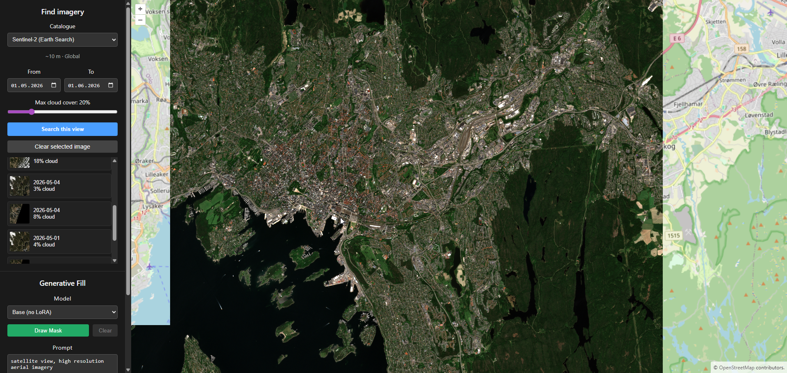

# Frontend — Satellite Generative Fill

React 19 + Vite + TypeScript + [OpenLayers](https://openlayers.org/) map UI. Lets users
search satellite imagery, stream a COG onto the map, draw a polygon, and request an
inpainted patch from the backend. See the [root README](../README.md) for the full
workflow and architecture.



## Run

```bash
npm ci
npm run dev          # http://localhost:5173
npm run build        # tsc -b + vite build (use this as the CI/lint gate)
npm run lint         # ESLint
npm run format       # prettier --write . (format in place)
npm run format:check # prettier --check . (CI-friendly, no writes)
```

The backend base URL is read from `VITE_API_URL` (default `http://localhost:8000`); set it
in a `frontend/.env` file if your backend runs elsewhere.

## Source map (`src/`)

| File                      | Responsibility                                                                                              |
| ------------------------- | ----------------------------------------------------------------------------------------------------------- |
| `App.tsx`                 | Top-level state + wiring: models, selected scene, mask, overlay list, generate/edit/download.               |
| `api.ts`                  | Typed backend client: `getModels`, `getCatalogs`, `getEvents`, `searchCatalog`, `inpaint`. All fetch calls. |
| `CatalogPanel.tsx`        | Imagery search: catalogue + event selectors, date / cloud filters, scene list (sorted newest-first).        |
| `PromptPanel.tsx`         | Model `<select>`, mask draw/clear, prompt + negative prompt, advanced inference options, Generate.          |
| `GeneratedImagesList.tsx` | List of generated patches with per-item show/hide, zoom-to-extent, edit, and remove controls.               |
| `MapView.tsx`             | OpenLayers map: COG streaming, polygon drawing, result overlays, footprint preview, view extent.            |
| `main.tsx`                | React entry point.                                                                                          |

`MapView` is lazy-loaded (`React.lazy`) so the side panel paints before the ~900 KB
OpenLayers/GeoTIFF bundle streams in.

## How the pieces talk

- `MapView` streams the selected scene's `visual_href` COG directly from S3 via OpenLayers'
  `GeoTIFF` source on a `WebGLTileLayer` — imagery does **not** pass through the backend.
- `MapView` hands its `Map` instance up via `onMapReady`; `App` reads the view's _actual_
  projection (a loaded COG switches the view to its native UTM) to compute the current
  extent (WGS-84) for catalogue search and to fit the map to event-catalogue results.
- Drawing a polygon emits a GeoJSON `Polygon` (EPSG:4326), rejected if it falls outside the
  loaded image. `App` derives its bbox and posts it with the prompt + `model_id` + advanced
  options to `/inpaint`. Each result is stored as a `ResultOverlay` (keyed by a per-mask
  UUID) and rendered as an `ImageStatic` `ImageLayer` at the returned bbox.
- The `inpaint` client handles two backend paths: SD1.5 returns the PNG synchronously; FLUX
  returns `202` + a job ID, which the client polls at `/jobs/{id}` (surfacing
  download/inference status) until done.
- `GeneratedImagesList` manages the overlay stack: toggle visibility, zoom to a patch's
  extent, **Edit** (restores that overlay's mask + prompt + params into the panels for
  re-generation), or remove. "Download Last Patch" saves the most recent overlay as a PNG.

## Conventions

- All backend calls go through `api.ts` — don't scatter `fetch` elsewhere.
- Coordinates crossing the API boundary are **WGS-84 (EPSG:4326)**; the map renders in
  EPSG:3857 (or a COG's native UTM once loaded), so transform at the boundary (see
  `transformExtent` usage in `App`/`MapView`).
- Inference slider defaults in `PromptPanel` mirror the backend (`pipeline.py`) per model
  family — keep them in sync. FLUX is guidance-distilled, so its negative-prompt and
  strength controls are hidden.
- `npm run build` must pass (it runs `tsc -b`) before committing.
